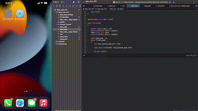
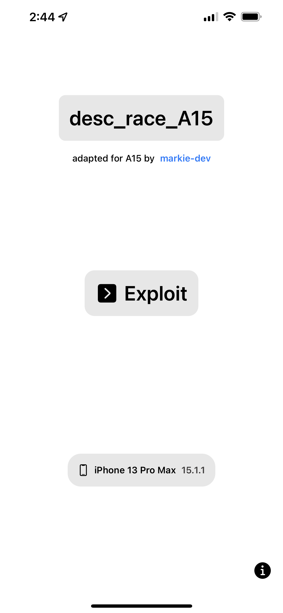
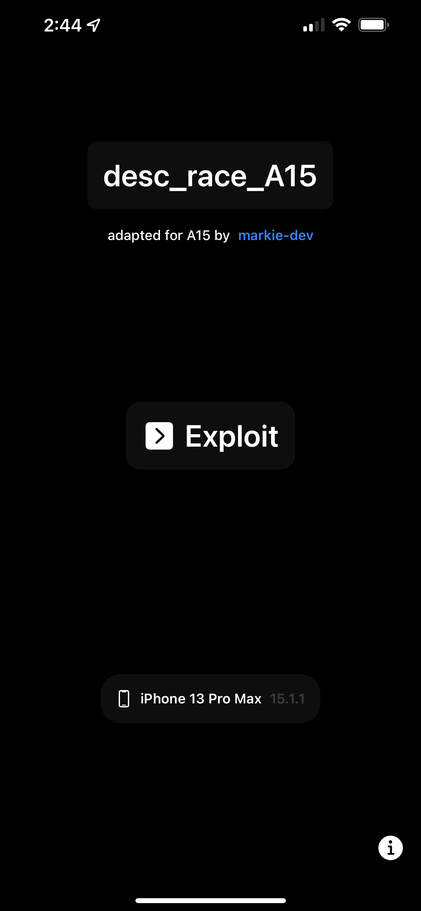

# desc_race_A15
CVE-2021-30955 iOS 15.1.1 POC for 6GB RAM devices (A14-A15)

- Made with SwiftUI and C
- Based off of [@b1n4r1b01](https://twitter.com/b1n4r1b01)['s exploit](https://github.com/b1n4r1b01/desc_race)
- [Write-up](https://www.cyberkl.com/cvelist/cvedetail/24) [of](https://c.tenor.com/PNPcRrIeLkwAAAAC/youtooz-among-us.gif) [@realBrightiup](https://twitter.com/realbrightiup)['s POC](https://www.cyberkl.com/cvelist/cvedetail/24)
- Improves A14-A15 support
- Tested on iPhone 13 Pro Max

# Results
- Achieves write privileges
- Panic's immediately due to A12+
- generates logs in `/Settings/Privacy/Analytics&Improvements/Analytics Data`

# Screenshots

  
   

# Credits
- [@realBrightiup](https://twitter.com/realbrightiup)
- [@b1n4r1b01](https://twitter.com/b1n4r1b01)
- [@jakeashacks](https://twitter.com/jakeashacks)
- [@pattern-f](https://twitter.com/pattern_F_)
